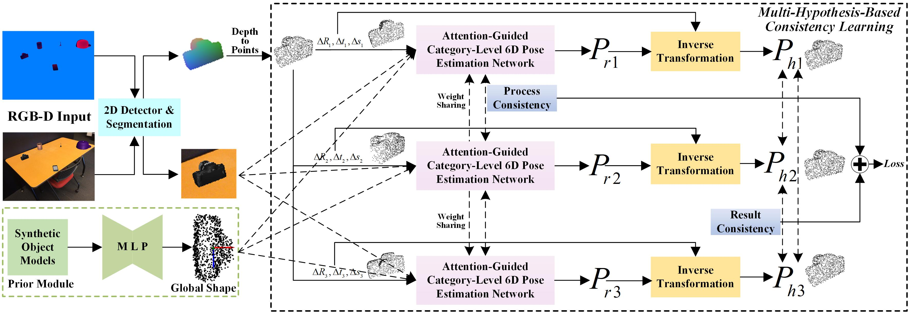

# MH6D: Multi-Hypothesis Consistency Learning for Category-Level 6D Object Pose Estimation

This is the PyTorch implementation of paper **[MH6D](10.1109/TNNLS.2024.3360712)** published in <b>*IEEE TNNLS*</b> by <a href="https://cnjliu.github.io/">J. Liu</a>, W. Sun, C. Liu, H. Yang, X. Zhang, and <a href="https://ajmalsaeed.net/">A. Mian</a>.

<p align="center">

</p>

## Installation
Our code has been tested with
- Ubuntu 20.04
- Python 3.8.0
- CUDA 11.0.3
- PyTorch 1.8.0
- gorilla-core 0.2.5.3

Some dependent packages：
- [gorilla](https://github.com/Gorilla-Lab-SCUT/gorilla-core) 
```
pip install gorilla-core==0.2.5.3
```
- [pointnet2](https://github.com/erikwijmans/Pointnet2_PyTorch)
```
cd model/pointnet2
python setup.py install
```

## Dataset
Download [camera_train](http://download.cs.stanford.edu/orion/nocs/camera_train.zip), [camera_val](http://download.cs.stanford.edu/orion/nocs/camera_val25K.zip),
[real_train](http://download.cs.stanford.edu/orion/nocs/real_train.zip), [real_test](http://download.cs.stanford.edu/orion/nocs/real_test.zip),
[ground-truth annotations](http://download.cs.stanford.edu/orion/nocs/gts.zip),
[mesh models](http://download.cs.stanford.edu/orion/nocs/obj_models.zip), and [segmentation results](https://drive.google.com/file/d/1hNmNRr7YRCgg-c_qdvaIzKEd2g4Kac3w/view?usp=sharing).
Unzip and organize these files in ../data as follows:
```
data
├── CAMERA
│   ├── train
│   └── val
├── camera_full_depths
│   ├── train
│   └── val
├── Real
│   ├── train
│   └── test
├── gts
│   ├── val
│   └── real_test
├── obj_models
│   ├── train
│   ├── val
│   ├── real_train
│   └── real_test
├── segmentation_results
│   ├── train_trainedwoMask
│   ├── test_trainedwoMask
│   └── test_trainedwithMask
└── mean_shapes.npy
```
Run python scripts to prepare the datasets:
```
python data_processing.py
```

## Evaluation
You can download our pretrained model [epoch_30.pth](https://drive.google.com/file/d/1GADDsyOaz8wV2CDe-tykNWTR1-oAWrtq/view?usp=sharing) and put it in the '../log1/3MH_sys' directory. Then, you can have a quick evaluation using the following command.
```
python test.py --config config1/3MH_sys.yaml
```
Note that there is a small mistake in the original evaluation code of [NOCS](https://github.com/hughw19/NOCS_CVPR2019/blob/dd58dbf68feede04c3d7bbafeb9212af1a43422f/utils.py#L252) for the 3D IOU metrics. We thank [CATRE](https://github.com/THU-DA-6D-Pose-Group/CATRE) and [SSC-6D](https://github.com/swords123/SSC-6D) for pointing out this. We have revised it and recalculated the metrics of some methods. The revised evaluation code is given in our released [code](https://github.com/CNJianLiu/MH6D/blob/ef9703855a1d87105c6638dde1f9712dbff9b0a7/utils/evaluation_utils.py#L517).

## Train
To train the model, remember to download the complete dataset, and organize and preprocess the dataset properly.

train_sys.py is the main file for training. You can start training using the following command.
```
python train_sys.py --gpus 0 --config config1/3MH_sys.yaml
```
## Citation
If you find the code useful, please cite our paper.
```latex
@article{TII2023,
  author={Liu, Jian and Sun, Wei and Liu, Chongpei and Yang Hui and Zhang, Xing and Mian, Ajmal},
  journal={IEEE Transactions on Neural Networks and Learning Systems},
  title={MH6D: Multi-Hypothesis Consistency Learning for Category-Level 6D Object Pose Estimation},
  year={2024},
  publisher={IEEE},
  doi={10.1109/TNNLS.2024.3360712}
}
```

## Acknowledgment
Our code is developed based on [DPDN](https://github.com/JiehongLin/Self-DPDN). We thank the authors for releasing the codes.

## Licence

This project is licensed under the terms of the MIT license.
